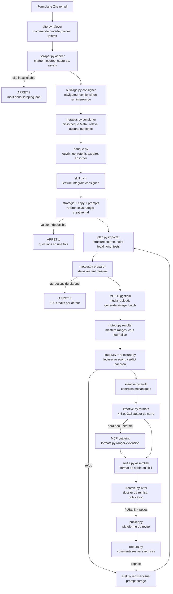

# Architecture de la chaîne

La carte du système : qui fait quoi, dans quel ordre, et où chaque décision
peut s'arrêter. Les modules vivent dans `scripts/`, les données dans l'espace
de travail (`KREATIVE_TRAVAIL`), le métier créatif dans `references/`.

Un seul pilote : `scripts/pipeline/parcours.py suivant <ardoise>` lit le disque
et donne la prochaine action. La session l'exécute et relance le parcours,
jusqu'à l'étape `livree`.

## Le flux, du formulaire au pack livré

## Les modules

| module | rôle | ce qu'il écrit |
|---|---|---|
| `pipeline/parcours.py` | la seule prochaine étape, décidée par le disque ; `exiger` sert de verrou avant une étape | rien, il lit |
| `pipeline/zite.py` | relève l'API Zite, ouvre les commandes, fusionne une resoumission sous 30 jours | `commandes/_zite/`, `commandes/<ardoise>/brief/` |
| `pipeline/scraper.py` | parcourt le site dans Chromium, mesure les styles CALCULÉS, capture chaque page | `marque/charte-site.json`, `site.json`, `assets-site/`, `captures/`, `logo/`, `scraping.json` |
| `pipeline/dossier.py` | registre des fichiers fournis par le client : chacun doit être ouvert avant le plan | `session/dossier.json` |
| `pipeline/outillage.py` | l'étape 0 du skill : navigateur vérifié sur le site, sinon run interrompu | `marque/outillage.json` |
| `pipeline/sortie.py` | assemble le « Format de sortie » du skill : synthèse, angles, créatives et prompts, garde-fous | `sortie-strategie.md`, puis `STRATEGIE-ET-PROMPTS.md` dans la remise |
| `pipeline/metaads.py` | trace de la tentative sur la bibliothèque publicitaire Meta : annonces relevées, aucune, ou échec motivé ; exigée avant le premier plan | `marque/meta-ads.json` |
| `pipeline/banque.py` | la banque de références sous registre : famille, planches lues, refs retenues, extraites, absorbées | `session/banque.json`, `session/references/` |
| `pipeline/skill.py` | consigne la lecture intégrale du skill de stratégie, avec son empreinte | `session/skill.json` |
| `pipeline/atelier.py` | galerie visuelle de la commande : planches, refs, captures, masters | `atelier.html` |
| `pipeline/redaction.py` | transforme les réponses brutes du formulaire en brief | `brief/brief.json` |
| `pipeline/plan.py` | range le plan de la session dans les créas, contrôles du skill compris (structure source, copy dans le prompt, formule anti-régénération) | `creas/cNN.json` |
| `pipeline/etat.py` | le modèle de données : Commande, Crea, Copy, Prompt, états, reprises | `commande.json`, `creas/`, `journal.jsonl` |
| `pipeline/couts.py` | la table de prix MESURÉE, calibrée à chaque lot récolté | `_couts/couts-observes.jsonl` |
| `pipeline/moteur.py` | écrit le lot à générer et range le résultat ; n'appelle jamais Higgsfield lui-même | `jobs/`, `masters/` |
| `pipeline/loupe.py` | découpe chaque master en quatre zones pour la lecture au zoom | `session/loupe/` |
| `pipeline/relecture.py` | registre des verdicts de relecture, un par créa, périmé si le master change | `relecture.json` |
| `pipeline/audit.py` | contrôles mécaniques : verdict de relecture présent, doublons, chiffres, format | rapport, événement `audit` au journal |
| `pipeline/formats.py` | tire le 4:5 et le 9:16 du master carré sans le toucher ; liste ce qu'il faut étendre | `dist/`, `formats/a-etendre.json` |
| `pipeline/livrer.py` | le dossier de remise hors de l'espace de travail, et la notification | `KREATIVE_LIVRAISONS/`, événement `dossier_livraison` |
| `pipeline/vue.py` | la page de suivi locale | `suivi.html` |
| `pipeline/publier.py` | pousse visuels et textes vers la plateforme de revue, jamais une donnée personnelle | `publication/<slug>/` + dépôt distant |
| `pipeline/retours.py` | redescend les commentaires en corrections exécutables | `retours/`, `reprises/` |
| `pipeline/sante.py` | contrôle de branchement de la chaîne dans n'importe quel environnement | verdicts |
| `pipeline/exporter.py` | instantané de l'état des commandes pour le back-office | `backoffice/donnees.json` |
| `outils/ranger.py` | création et contrôle de cohérence d'une commande | verdicts |
| `orchestrateur.py` | la boucle sans humain : relever, aspirer, inventorier ; s'arrête avant la stratégie | journal de cycle |
| `kreative.py` | le point d'entrée : prompts, generer, formats, audit, livrer, etat, page, parcours, atelier, verifier | selon la commande |

## Les trois arrêts, et pourquoi eux

La chaîne du 08/09 tournait sans aucun arrêt : sept rendus produits, sept
rejetés, personne en position d'arrêter la dépense. Les arrêts sont la
correction de ce défaut, et il n'en existe que trois pour que « s'arrêter »
reste une information :

1. **Brief incomplet** sur une valeur que ni le brief ni le site ne donnent.
   Les questions partent en une seule fois.
2. **Site inexploitable** : mur de connexion, page de garde, site vide. Le
   motif est écrit dans `marque/scraping.json`.
3. **Devis au-dessus du plafond** : 120 crédits par commande par défaut.

## Les coûts, mesurés et non déclarés

| poste | valeur mesurée | source |
|---|---|---|
| `nano_banana_pro`, texte vers image | 2 crédits | relevé de transactions, 17/09/2026 |
| `nano_banana_pro`, image vers image | 2 crédits, même prix | relevé de transactions, 17/09/2026 |
| extension de format (outpaint), 4:5 ou 9:16 | 2 crédits | devis du connecteur, 26/09/2026 |
| pack de 18 créas | 36 crédits au devis | lot du client B, 17/09/2026 |

La table vivante est `pipeline/couts.py` : elle se recalibre à chaque
`recolter` (solde avant, solde après), et le devis alerte quand l'écart
mesuré dépasse sa tolérance. Un chiffre de coût écrit en dur dans le code ou
dans un document est une faute : cinq ont déjà été délogés.

## Ce que la chaîne ne fait pas

- Elle ne régénère jamais une créa pour la décliner : le 4:5 et le 9:16
  entourent le carré, qui reste intact au pixel près (cahier des charges, 4.2).
- Elle n'appelle jamais Higgsfield par la CLI ni par une API directe.
- Elle ne tourne pas sans session : la stratégie, les prompts et la relecture
  demandent une session Claude Code. L'orchestrateur prépare, la session
  produit.
- Elle n'envoie jamais le nom, l'adresse ou le téléphone d'un client final
  vers la plateforme de revue : ces champs restent dans `brief/` sur le
  poste.
